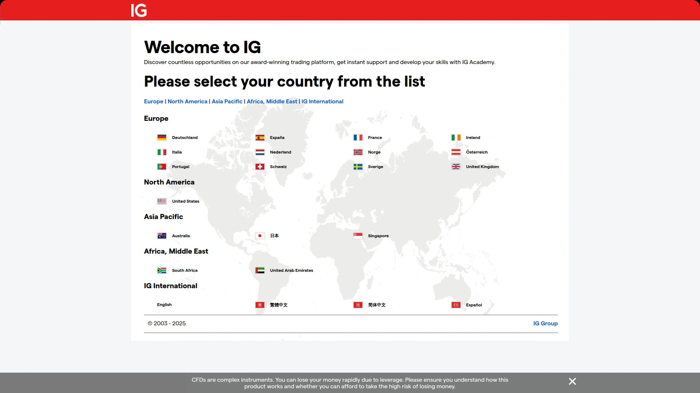
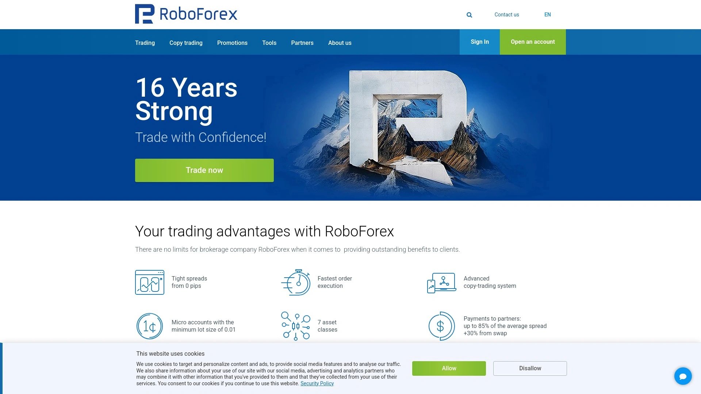

# 18家全球最佳外汇经纪商（MT4/MT5交易）

想选一站式外汇交易平台，却总被点差、滑点、延迟和出入金效率困扰？
本清单聚焦受监管的外汇经纪商，覆盖 MT4/MT5 与主流 CFD 交易品种，兼顾低成本与稳定性。
你将清楚知道哪些平台更适合日内/波段/EA，如何在成本、执行与覆盖范围之间做取舍。

## [Blueberry Markets](<https://www.blueberrymarkets.com>)
澳洲受监管外汇平台，点差透明稳定。

- 核心亮点：支持 MT4/MT5，EA 与 VPS 友好；覆盖外汇、指数、贵金属等常见差价合约；订单执行顺滑，滑点控制稳；中文支持响应快。
- 成本与账户：点差与手续费结构清晰，账户类型易理解，适合从新手到进阶的迁移。
- 上手难度：界面与指引简洁，几步即可完成开户与入金，适合希望快速部署的交易者。
- 推荐理由：对稳定性与服务有要求的日内/波段/EA 用户，可在成本、执行与支持之间取得均衡。

## [Pepperstone](<https://www.pepperstone.com>)
低延迟执行与深度流动性，适合日内。

- 特色：优质成交速度、较优报价深度，支持 MT4/MT5 与第三方量化生态。
- 适用：剥头皮、新闻交易、EA 自动化等对时效敏感的策略。
- 体验：开户与验证流程顺畅，教育与研究内容完善。

## [IC Markets](<https://www.icmarkets.com>)
ECN架构撮合快速，擅长高频策略。

IC 风格的撮合体验与稳定报价，配合 MT4/MT5 及 API/EA，可覆盖从高频到网格的多种策略。
- 账户与成本：原始点差配合手续费模式可控，适合规模化交易。
- 适合人群：追求执行一致性与可扩展性的量化与日内。

## [IG](<https://www.ig.com>)
老牌受监管券商，市场覆盖极其广泛。

- 强项：自研平台功能全面，研究报告与数据源丰富；同时支持 MT4。
- 使用场景：外汇+指数+商品+数字资产差价合约一站式管理。
- 成本与工具：图表、警报、风险管理工具齐备，便于体系化交易。

## [OANDA](<https://www.oanda.com>)
报价稳定透明，适合长期策略与EA。

- 体验：稳定的点差表现、较为稳健的订单处理；API 与 MT4 兼容度佳。
- 适用策略：中长线、EA 回测迁移、统计套利等对数据一致性更敏感的场景。
- 额外价值：教育资料与研究工具对新手友好。

## [CMC Markets](<https://www.cmcmarkets.com>)
平台功能全面，图表与订单流工具强。

- 看点：多图表联动、深度工具包、完善的风险管理模块。
- 谁更适合：需要精细化下单与组合管理的主动型交易者。
- 成本：多资产统一体验，整体成本可控，适合多品种轮动。

## [Exness](<https://www.exness.com>)
弹性杠杆与稳定出入金，适合多策略。

- 优势：账户与杠杆选择多，执行稳定；覆盖主流外汇与商品差价合约。
- 使用：适合从微型仓位练习到策略放大的过渡。
- 体验：后台与出入金流程顺滑，维护便捷。

## [XM](<https://www.xm.com>)
入门友好，教育内容丰富且中文齐全。

- 特色：丰富的研讨会、课程与策略材料，配合 MT4/MT5 快速上手。
- 适用：新手到中级交易者，重视学习曲线与服务支持。
- 成本：账户门槛较低，试错成本更可控。

## [AvaTrade](<https://www.avatrade.com>)
合规覆盖广，提供多终端与自动化。

- 平台：MT4/MT5、网页版与移动端齐全；支持常见自动化与提醒。
- 场景：中短线、价格行为、事件驱动均可覆盖。
- 价值点：全球化服务网络，支持多语种与多支付方式。

## [FP Markets](<https://www.fpmarkets.com>)
澳洲经纪背景，低成本多资产一站式。

- 卖点：报价竞争力、执行稳定，品种覆盖外汇/指数/金属/商品。
- 适用人群：想在一个账户内管理多资产、控制滑点与成本的交易者。
- 上手：账户类型清晰，迁移与扩容方便。

## [Tickmill](<https://www.tickmill.com>)
点差与滑点控制佳，适合剥头皮。

- 优势：对快进快出的交易友好，常见下单类型齐全。
- 成本视角：原始点差+手续费模式清楚，便于核算策略边际。
- 推荐给：日内与剥头皮用户、对执行一致性较敏感者。

## [Eightcap](<https://www.eightcap.com>)
原始点差账户灵活，支持视图插件。

- 特色：MT4/MT5 完整支持，量化与图表生态扩展空间大。
- 使用体验：开户与配置流程简明，移动端同步良好。
- 场景：短线、EA、商品与指数差价合约组合。

## [Admirals](<https://www.admirals.com>)
老牌欧洲券商，学习资源与工具多。

- 强项：教育内容扎实、分析工具丰富；MT4/MT5 环境成熟。
- 适用：系统化交易与长期资金管理，重视风控与复盘。
- 成本：费用结构明晰，便于长期对账与对比。

## [HFM](<https://www.hfm.com>)
账户类型多样，支持复制交易与EA。

- 亮点：从微型到专业账户覆盖广，满足不同阶段需求。
- 使用：手动、EA 与跟随交易并行，适合策略多元化管理。
- 服务：多语种支持，常见支付通道覆盖全面。

## [RoboForex](<https://www.roboforex.com>)
策略工具丰富，VPS与多终端支持。

- 工具：多种账户形态与平台组合，VPS 支持稳定。
- 场景：量化研究、网格、分散化交易。
- 成本与效率：下单与结算流程清晰，维护成本可预期。

## [Plus500](<https://www.plus500.com>)
界面简单好上手，适合移动端交易。

- 卖点：轻量化平台与直观 UI，新手更易上手。
- 适合：价格形态与事件驱动的中短线，移动端下单为主的用户。
- 提示：以简洁为优先，进阶工具可搭配外部分析解决。

## [eToro](<https://www.etoro.com>)
社交交易见长，便于跟随与社区互动。

- 特点：社群化发现策略，直观的跟随交易体验。
- 使用：适合想从优秀交易者中学习、观察与复制思路的用户。
- 价值：社区讨论与情绪观察可辅助择时与风控。

## [FXCM](<https://www.fxcm.com>)
历史久品牌稳定，多类工具可扩展。

- 强项：研究工具、数据流与策略支持全面；MT4/自研平台可选。
- 场景：从学习、模拟到实盘过渡顺畅，适合稳健派。
- 成本：费用结构清楚，配合风险管理工具更易控损。

---

### 常见问题 FAQ

- 如何快速判断一家外汇经纪商是否适合自己的策略？
  先用模拟账户测试 3–5 天，记录平均点差、典型滑点与订单执行；再小额实盘验证出入金与客服响应，确保与策略需求匹配。

- 新手在 MT4/MT5 上怎样更快上手外汇交易平台？
  先导入模板与常用指标，设置交易品种自选与价格提醒；练习下单、止损/移动止损与仓位控制，再逐步接入 EA 或半自动工具。

- 评估实际交易成本看什么指标更靠谱？
  以“平均点差+手续费+隔夜费+滑点”做实盘统计（按策略时间框架拆分），每周复盘对比不同平台的净成本与执行稳定性。

---

### 总结
以上 18 家外汇经纪商覆盖了从新手到量化的主要场景，兼顾成本、执行与品种广度。若你优先关注稳定执行、清晰成本与中文支持，首选的 [Blueberry Markets](<https://www.blueberrymarkets.com>) 更具综合性价比。
建议先用小额/模拟验证你的策略与平台契合度，再逐步放大规模，持续复盘与优化。
